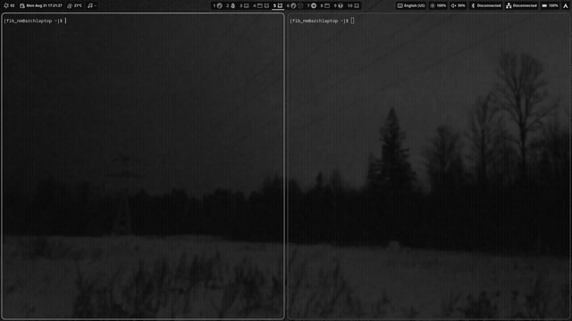

# wlapse

`wlapse` is a small stopwatch overlay for Wayland. Run the same command to show or stop it:

```sh
wlapse
```

There is no daemon, tray icon, or background process.



## Features

- Displays elapsed time as `HH:MM:SS.t`.
- Stays above other windows.
- Can be moved by dragging it with the left mouse button.
- Remembers its position between runs.
- Supports custom background and text colors.
- Works with Sway, Hyprland, Niri and KDE Plasma.

## Requirements

- Linux with an active Wayland session.
- A compositor that supports `wlr-layer-shell` and `relative-pointer-v1`.
- Rust 1.98 or newer and Cargo to build from source.

X11 and compositors without Layer Shell, including GNOME, are not supported.

## Install

### Arch Linux (AUR)

Install the source-built [`wlapse`](https://aur.archlinux.org/packages/wlapse) package
with an AUR helper such as `paru`:

```sh
paru -S wlapse
```

### Release archive

Download the archive for your architecture from the
[latest release](https://github.com/fib-nm/wlapse/releases/latest), then extract and install
the binary (replace `X.Y.Z` with the downloaded version):

```sh
tar -xf wlapse-vX.Y.Z-x86_64-unknown-linux-gnu.tar.xz
install -Dm755 wlapse-vX.Y.Z-x86_64-unknown-linux-gnu/wlapse "$HOME/.local/bin/wlapse"
```

Make sure `$HOME/.local/bin` is in `PATH`.

### Verify the download

To verify the archive before extracting it, also download `SHA256SUMS` from the release,
keep both files in the same directory, and run:

```sh
sha256sum --check SHA256SUMS
```

### Build from source

```sh
git clone https://github.com/fib-nm/wlapse.git
cd wlapse
cargo build --release --locked
install -Dm755 target/release/wlapse "$HOME/.local/bin/wlapse"
```

## Usage

Run `wlapse` to show the stopwatch:

```sh
wlapse
```

Run it again to stop the stopwatch:

```sh
wlapse
```

Show command help or the installed version:

```sh
wlapse --help
wlapse --version
```

Sway key binding:

```text
bindsym $mod+<key> exec wlapse
```

Hyprland 0.55+ key binding (`hyprland.lua`):

```lua
hl.bind("SUPER + <key>", hl.dsp.exec_cmd("wlapse"))
```

## Colors

To change the colors, create `$XDG_CONFIG_HOME/wlapse/config`. If `XDG_CONFIG_HOME` is not set, use `$HOME/.config/wlapse/config`.

```ini
background_color = #202229d9
text_color = #ffffff
```

Colors can use `#RRGGBB` or `#RRGGBBAA`. The optional alpha value controls transparency. Missing settings use the default colors, and lines starting with `#` are ignored as comments.

Changes take effect the next time the stopwatch starts. An invalid setting is reported as an error instead of being ignored.

## Moving the stopwatch

Drag the overlay with the left mouse button. `wlapse` saves the new position when you release the button.

To reset the position, stop `wlapse` and delete:

```text
$XDG_STATE_HOME/wlapse/placement
```

If `XDG_STATE_HOME` is not set, delete:

```text
$HOME/.local/state/wlapse/placement
```

### Lag while dragging in Hyprland

Hyprland may animate the overlay while it is being moved, which makes it lag behind the pointer. Disable animation for `wlapse` to fix this.

For Hyprland 0.55 and newer, add this to `hyprland.lua`:

```lua
hl.layer_rule({
    name = "wlapse-no-animation",
    match = { namespace = "^wlapse$" },
    no_anim = true,
})
```

For Hyprland 0.54 and older, add this to the legacy configuration:

```ini
layerrule = noanim, ^(wlapse)$
```

## License

`wlapse` is licensed under the [MIT License](LICENSE).
