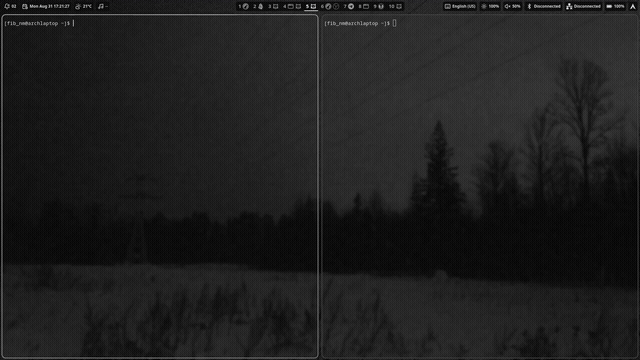

# wlapse

A stopwatch overlay for Wayland that can be turned on and off with a keybind.



## Key Features

- Can be turned on and off with a keybind.
- Doesn't require daemon or autostart.
- Can be moved by dragging it with the left mouse button.
- Remembers its position between runs.
- Supports custom background and text colors.

## Requirements

- Linux with an active Wayland session.
- A compositor that supports both `wlr-layer-shell` and `relative-pointer-v1`.
- Rust 1.98 or newer and Cargo to build from source.

X11 is not supported.

## Compositor compatibility

`wlapse` requires both [`wlr-layer-shell`](https://wayland.app/protocols/wlr-layer-shell-unstable-v1) and [`relative-pointer-v1`](https://wayland.app/protocols/relative-pointer-unstable-v1). If either protocol is missing, `wlapse` will not work.

| Compositor | `wlr-layer-shell` | `relative-pointer-v1` | `wlapse` |
|---|:---:|:---:|:---:|
| COSMIC compositor (COSMIC) | Yes | Yes | Supported |
| dwl | Yes | Yes | Supported |
| Gamescope | Yes | Yes | Supported |
| Hyprland | Yes | Yes | Supported |
| Jay | Yes | Yes | Supported |
| KWin (KDE Plasma) | Yes | Yes | Supported |
| Labwc | Yes | Yes | Supported |
| Louvre | Yes | Yes | Supported |
| Mir | Yes | Yes | Supported |
| Muffin (Cinnamon) | Yes | Yes | Supported |
| niri | Yes | Yes | Supported |
| phoc (Phosh) | Yes | Yes | Supported |
| river | Yes | Yes | Supported |
| Sway | Yes | Yes | Supported |
| SwayFX | Yes | Yes | Supported |
| Wayfire | Yes | Yes | Supported |
| Cage | No | Yes | Not supported |
| Mutter (GNOME) | No | Yes | Not supported |
| Treeland (DDE) | Yes | No | Not supported |
| Weston | No | Yes | Not supported |

The table is based on compositor protocol support rather than per-compositor integration code in `wlapse`. Protocol support can change between compositor versions.

## Install

### Arch Linux (AUR)

Install the official AUR package:

```sh
paru -S wlapse
```

### AppImage

Download the x86_64 AppImage from the
[latest release](https://github.com/fib-nm/wlapse/releases/latest), then install it
for your user (replace `X.Y.Z` with the downloaded version):

```sh
install -Dm755 wlapse-vX.Y.Z-x86_64.AppImage "$HOME/.local/bin/wlapse"
```

Make sure `$HOME/.local/bin` is in `PATH`. To update wlapse later, replace this file
with the AppImage from the newer release. Running an AppImage normally requires
FUSE. On systems where FUSE is unavailable, use its extraction fallback:

```sh
APPIMAGE_EXTRACT_AND_RUN=1 wlapse
```

### Release

Download the latest release from the
[latest release](https://github.com/fib-nm/wlapse/releases/latest), then extract and
install the binary (replace `X.Y.Z` with the downloaded version):

```sh
tar -xf wlapse-vX.Y.Z-x86_64-unknown-linux-gnu.tar.xz
install -Dm755 wlapse-vX.Y.Z-x86_64-unknown-linux-gnu/wlapse "$HOME/.local/bin/wlapse"
```

Make sure `$HOME/.local/bin` is in `PATH`.

To verify an AppImage or archive before installing it, also download `SHA256SUMS`
from the release, keep it beside the downloaded file, and run:

```sh
sha256sum --check --ignore-missing SHA256SUMS
```

### Build from source

```sh
git clone https://github.com/fib-nm/wlapse.git
cd wlapse
cargo build --release --locked
install -Dm755 target/release/wlapse "$HOME/.local/bin/wlapse"
```

## Usage

Bind the command `wlapse` to any unused key combination. The examples below use
<kbd>Super</kbd>+<kbd>T</kbd>.

### Sway

Add this to your Sway config:

```text
bindsym $mod+t exec wlapse
```

### Hyprland

Add this to `hyprland.lua`:

```lua
hl.bind("SUPER + T", hl.dsp.exec_cmd("wlapse"))
```

### Niri

Add this inside the `binds` section of your Niri config:

```kdl
Mod+T { spawn "wlapse"; }
```

### KDE Plasma

Open **System Settings → Keyboard → Shortcuts**, choose
**Add New → Command or Script**, enter `wlapse` as the command, and assign your
preferred shortcut.

Reload your compositor configuration if it does not apply the new binding
automatically.

### Command line

You can also invoke the same command from a terminal for testing:

```sh
wlapse
```

Show command help or the installed version:

```sh
wlapse --help
wlapse --version
```

## Colors

To change the colors, create `$XDG_CONFIG_HOME/wlapse/config`. If `XDG_CONFIG_HOME`
is not set, use `$HOME/.config/wlapse/config`.

```ini
background_color = #202229d9
text_color = #ffffff
```

Colors can use `#RRGGBB` or `#RRGGBBAA`. The optional alpha value controls
transparency. Missing settings use the default colors, and lines starting with `#`
are ignored as comments.

Changes take effect the next time the stopwatch starts. An invalid setting is
reported as an error instead of being ignored.

## Moving the stopwatch

Drag the overlay with the left mouse button. `wlapse` saves the new position when
you release the button.

To reset the position, stop `wlapse` and delete:

```text
$XDG_STATE_HOME/wlapse/placement
```

If `XDG_STATE_HOME` is not set, delete:

```text
$HOME/.local/state/wlapse/placement
```

### Lag while dragging in Hyprland

Hyprland may animate the overlay while it is being moved, which makes it lag behind
the pointer. Disable animation for `wlapse` to fix this.

Add this to `hyprland.lua`:

```lua
hl.layer_rule({
    name = "wlapse-no-animation",
    match = { namespace = "^wlapse$" },
    no_anim = true,
})
```

## License

`wlapse` is licensed under the [MIT License](LICENSE).
